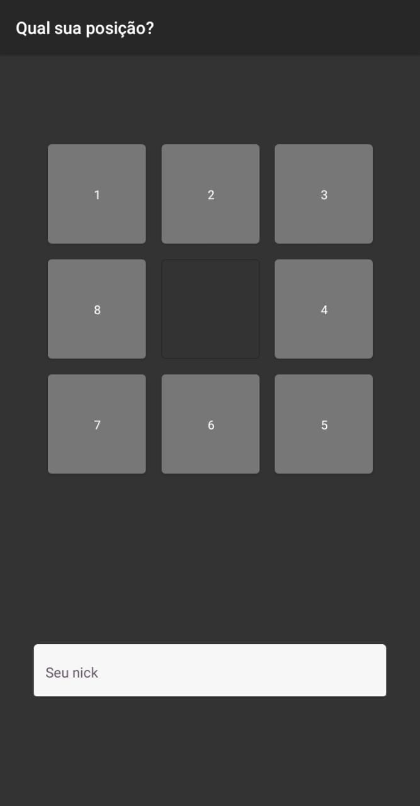
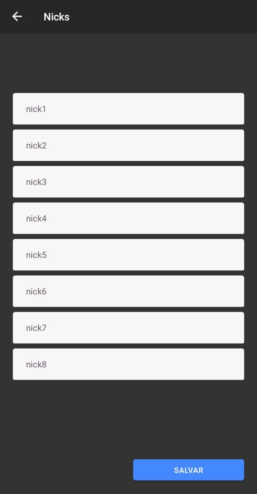
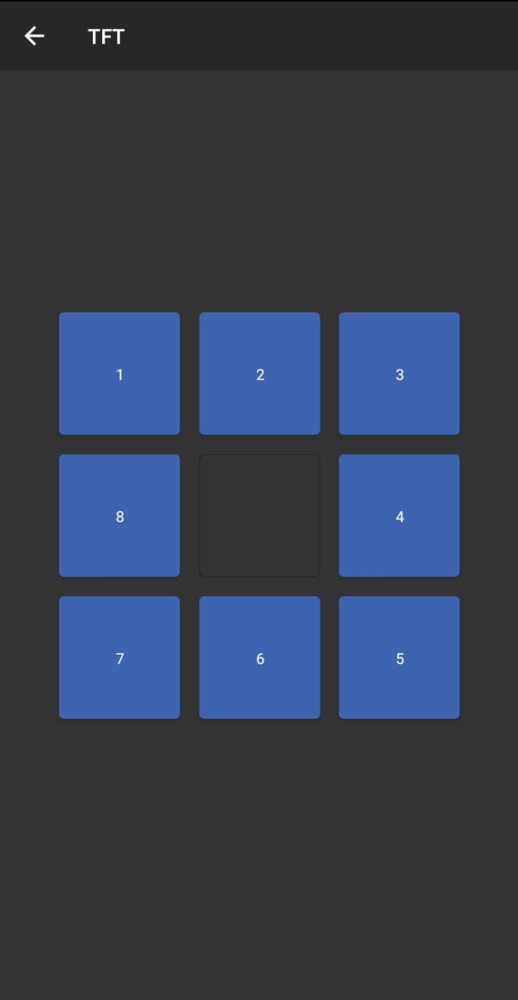

# Calculador de rounds do TFT


## Sumário:
- [Por quê?](#user-content-por-quê)
- [O que utilizei?](#user-content-o-que-utilizei)
- [Rodando o projeto](#user-content-como-rodar-desenvolvimento)
- [Prints](#user-content-prints-do-projeto)
- [Gerando um Apk](#user-content-gerando-um-Apk)
- [O que falta?](#user-content-o-que-falta-ser-feito)

### Por quê?

Ao jogar tft, uma vantagem possível, é ter uma noção de quais os possíveis inimigos para a próxima rodada, podendo assim preparar os cards de acordo com as possibilidades.

### O que utilizei?

- RN Navigation 5 (stack);
- Async Storage (community version);

### Como rodar? (desenvolvimento)

Primeiro de tudo, é preciso instalar as dependências do projeto:
Então é nescessário iniciar o servidor do Metro, responsável por conectar o dispositivo à aplicação:
Em sequência, precisamos iniciar a aplicação em sí, neste momento se você tiver um emulador instalado, o emulador será iniciado automagicamente, se não houver um emulador, será preciso conectar um aparelho android em "modo adb", caso nenhum aparelho seja encontrado, a aplicação não será iniciada:
```
npm install
npm run start 
npm run android
```
* aplicação não testada em aparelhos com ios.

Gerando um Apk:
```
android/gradlew assembleRelease
```
### Prints do projeto: 

<table>
    <tbody>
        <tr>
            <td>
                Tela inicial:
            </td>
            <td>
                Configuração de nicks:
            </td>
            <td>
                Cálculo das rodadas:
            </td>
        </tr>
    </tbody>
<thead>
</thead>
    <tbody>
        <tr>
            <td>
            <br>


            </td>
            <td>


            </td>
            <td>


            </td>
        </tr>
    </tbody>
</table>

### O que falta ser feito:

- Corrigir falhas ao retornar para tela inicial, e ao mudar os status dentro da tela de cálculo, utilizando `useEffect`, para tratar a chamada dos componentes.
- Melhorar a interface, e a tela de splash.


<br>
<br>
<br>
<br>
<br>
<br>
<br>
<br>
<br>


